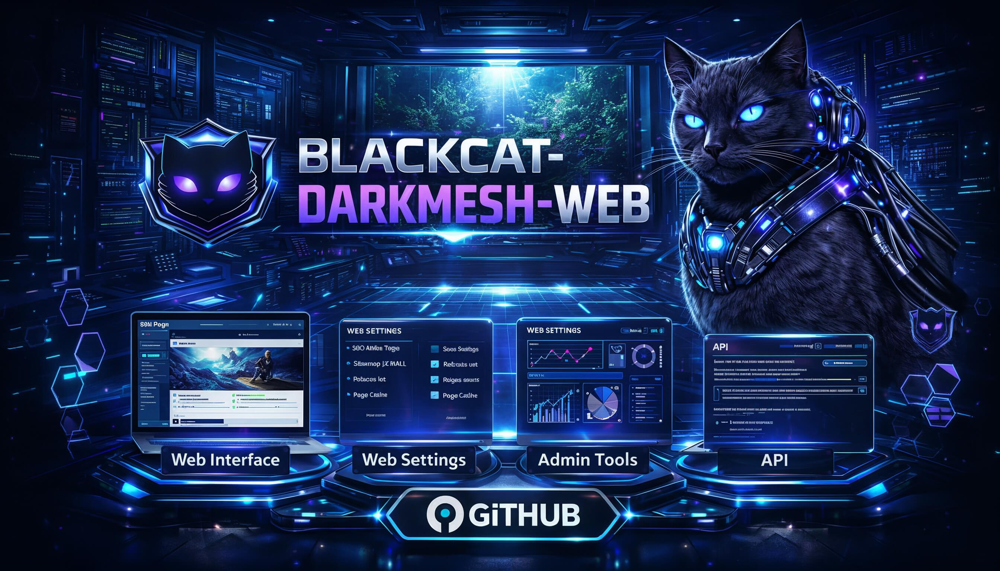

# Blackcat Darkmesh Web (Admin Console & Site Builder)
 

## Dev tips
- **CI matrix**: `smoke` (Playwright + artifact upload), `vault` (sealed/vaulted creds), `ao` (AO harness) in `.github/workflows/ci.yml`.
- **Bundle report (desktop UI)**: `cd desktop && BUNDLE_REPORT=1 npm run build:report` (creates `dist/renderer/bundle-report.html`).
- **Locale packs**: default EN ships in the main bundle; other locales lazy-load on first switch to keep the renderer cold-start small.
- **Animation gating**: hero canvas / holomap / cursor trail sit behind the FX toggle and `prefers-reduced-motion`; High FX auto-disables when reduced motion is set.
- **Neon hover utility**: add `class="neon-hover-glow"` (optional `--neon-hover-gradient`) for gradient hover/focus states across cyberpunk themes.
- **Playwright install faster**: set `PLAYWRIGHT_SKIP_DOWNLOAD=1` if Chromium is preinstalled; otherwise `npx playwright install --with-deps chromium`.
- **Headless on Linux CI**: `xvfb-run npm run test:smoke -- --project=chromium`.

Purpose
- Admin-facing console to build and operate a site/eshop.
- Maintains an offline-first sensitive database (PII) synced on demand from the Worker inbox (Cloudflare).
- Fetches trusted front-end templates from Arweave, validates via manifest, and assembles the site.
- Provides lightweight monitoring for gateway/AO/Write/Worker without external tooling.
- Manages keys: publishes public key to Arweave for client-side encryption; rotates keys; stores secrets offline only.

Key responsibilities
- **Offline PII store**: encrypted local DB, populated by pulling envelopes from Worker (delete-on-download).
- **Template management**: list trusted templates (manifest), pull from Arweave, render/build site bundle.
- **Console UI**: Tailwind CSS + PHP + JS stack for admin; can render static site preview and push to gateway.
- **Monitoring**: show ingest/apply status, PSP breaker state, cache hit/miss, webhook retry backlog (fetched from gateway metrics).
- **Key management**: generate/rotate admin keypair, publish public key to Arweave, distribute to browser clients.
- **AI Studio**: built-in agent (TS) that generates a “shopping list”/plan for gateway/write/AO; no PII is sent, uses prompts + schema in `ai-agent/`.
- **Telemetry**: read-only aggregates (usage/cache/webhook/psp) pulled from Arweave/AO exports and shown in admin UI; no PII or writes.
- **CLI bridge**: integrated `blackcat` wrapper for ops tasks (verify/export/templates) so we don’t depend on standalone `blackcat-cli`.
- **Template catalog bridge**: aggregates internal/external templates (from `blackcat-frontend-catalog` or feeds), stores txid/hash metadata, and lets gateway serve trusted Arweave templates.
- **Domain references (archived)**: logic/schemas from legacy `blackcat-commerce`, `blackcat-billing`, `blackcat-compliance` are reused for plans/quotes, invoicing, and audit checklist schemas; source repos are archived, only schemas/flows matter.
- **Governance/Federation (archived)**: legacy governance/federation/finance/fleet portals are archived; darkmesh keeps only the schemas/checklists needed in admin UI, no separate runtime.
- **Sync module (planned)**: lightweight DB sync/export inside web (for offline admin DB), replaces the archived `blackcat-database-sync` runtime; AO remains append-only on-chain.
- **DB engines (archived)**: traditional MySQL/Postgres umbrella (`blackcat-database`) is archived; darkmesh relies on AO (WeaveDB) + offline admin DB. Any needed helpers will be reimplemented inline.

Data flow (admin)
1) Admin logs into console (local session).
2) Console pulls pending envelopes from Worker (/inbox GET), decrypts locally, stores in offline DB.
3) Admin actions (orders, PII updates) stay local; commands to Write AO go through Gateway.
4) Front-end templates pulled from Arweave, validated against trusted manifest, rendered/deployed via Gateway.

Tech stack (proposed)
- PHP + Tailwind CSS + Vanilla JS (no heavy SPA) for simplicity and broad hosting.
- SQLite (local) or file-based encrypted store for offline PII; encryption keys kept locally only.
- CLI helpers for keygen/publish and Arweave manifest verification.
- Node/TS CLI (`npm run cli`) for telemetry pull, template sync, smoke helpers; requires Node 18+.

Security/Privacy
- PII never leaves admin device unencrypted; only encrypted blobs cached transiently at Worker/Gateway.
- Public key published to Arweave; private key stays local/offline backup.
- Console should warn on untrusted templates (manifest verification fails).

Open items
- Define manifest format for trusted templates.
- Exact metrics pull from Gateway (Prometheus/OpenMetrics or JSON endpoint).
- Deployment packaging (PHP runtime + cron/worker to pull inbox).

Roadmap ideas
- MVP: inbox sync + offline DB + template fetch/verify + deploy to gateway.
- Hardening: reproducible builds, CSP/SRI hints, template SBOM check.
- Monitoring UI: charts for cache hit/miss, PSP retries, ingest errors; local alerts thresholds.
- Key UX: guided rotation, hybrid PQC toggles, Arweave publish flow.
- Offline-first: queue admin actions when offline, reconcile on next sync.
- Packaging: one-click bundle (PHP runtime + cron sync + CLI key tools).

Flows (admin console)
1) **Sync PII**: Admin clicks “Sync inbox” → pull envelopes from Worker → decrypt locally → store in encrypted DB → mark as fetched (delete on Worker).
2) **Template update**: Admin selects Arweave template txid → verify manifest sig → fetch assets → render preview → publish to Gateway.
3) **Key publish**: Generate/rotate keypair → upload public key to Arweave + notify Gateway (for browser clients); private key stays local/offline backup.
4) **Monitoring view**: Pull metrics JSON/OpenMetrics from Gateway (cache hit/miss, PSP breaker, webhook backlog, ingest errors) → render charts; optional thresholds with local alerts.

Publish pipeline (draft)
- Build immutable assets (layout/theme/components/entry) → upload to Arweave, capture txid + sha256.
- Compose `PageManifest` + `AllowlistSnapshot` (see `src/manifest/models.ts`), sign, and include allowlist hash in manifest.
- Write manifest to Arweave; optionally emit AO/gateway pointer carrying manifest txid + checksum for cache warming.
- Refresh template catalog index through the GraphQL stub (`src/manifest/catalog.ts`) so the console can auto-load trusted templates.
- Verify by fetching manifest + entry bundle via gateway mirrors and comparing recorded checksums.

Next-gen features (ideas)
- **Offline-first ops**: queue admin actions while offline; sync via Gateway when back online.
- **Deterministic site builds**: reproducible bundle hash, signed manifest so Gateway can trust-deploy.
- **Template safety**: static analysis on templates (CSP hints, dependency SBOM) before publish; warn on unsafe APIs.
- **Security keys UX**: guided key rotation, hybrid PQC option (Ed25519+Dilithium / X25519+Kyber) when browser libs allow.
- **Minimal observability UI**: built-in dashboards for cache hit ratio, PSP retries, ingest apply errors, ForgetSubject events; exportable NDJSON for deeper analysis.

## Licensing

This repository is an official component of the Blackcat Covered System. It is licensed under `BFNL-1.0`, and repository separation inside `BLACKCAT_MESH_NEXUS` exists for maintenance, safety, auditability, delivery, and architectural clarity. It does not by itself create a separate unavoidable founder-fee or steward/development-fee event for the same ordinary covered deployment.

Canonical licensing bundle:
- BFNL 1.0: https://github.com/Vito416/blackcat-darkmesh-ao/blob/main/docs/BFNL-1.0.md
- Founder Fee Policy: https://github.com/Vito416/blackcat-darkmesh-ao/blob/main/docs/FEE_POLICY.md
- Covered-System Notice: https://github.com/Vito416/blackcat-darkmesh-ao/blob/main/docs/LICENSING_SYSTEM_NOTICE.md
